# Self-Driving Car Engineer Nanodegree Program
## Advanced Lane Finding Project
[](http://www.udacity.com/drive)


The goals / steps of this project are the following:

* Compute the camera calibration matrix and distortion coefficients given a set of chessboard images.
* Apply a distortion correction to raw images.
* Use color transforms, gradients, etc., to create a thresholded binary image.
* Apply a perspective transform to rectify binary image ("birds-eye view").
* Detect lane pixels and fit to find the lane boundary.
* Determine the curvature of the lane and vehicle position with respect to center.
* Warp the detected lane boundaries back onto the original image.
* Output visual display of the lane boundaries and numerical estimation of lane curvature and vehicle position.

### Code:
This project requires python 3.5 and the following dependencies:
```python
import numpy as np
import cv2, glob

import matplotlib.pyplot as plt
import matplotlib.image as mpimg
from moviepy.editor import VideoFileClip
from IPython.display import HTML
from collections import deque
%matplotlib inline
```

### Step 1: Distortion Correction
In this step, I used the OpenCV functions `findChessboardCorners` and `drawChessboardCorners` to identify the locations of corners on a series of pictures of a chessboard taken from different angles. Next, the locations of the chessboard corners were used as input to the OpenCV function `calibrateCamera` to compute the camera calibration matrix and distortion coefficients.  Finally, the camera calibration matrix and distortion coefficients were used with the OpenCV function `undistort` to remove distortion from highway driving images.


### Step 2: Perspective Transform
The goal of this step is to transform the undistorted image to a "birds eye view" of the road which focuses only on the lane lines and displays them in such a way that they appear to be relatively parallel to eachother (as opposed to the converging lines you would normally see). To achieve the perspective transformation I first applied the OpenCV functions `getPerspectiveTransform` and `warpPerspective` which takes a matrix of four source points on the undistorted image and remaps them to four destination points on the warped image. The source and destination points were selected manually by visualizing the locations of the lane lines on a series of test images.

Notice that if you compare the first two images as shown in the figure below, especially around the edges, there are obvious differences between the original and undistorted image, indicating that distortion has been removed from the original image.


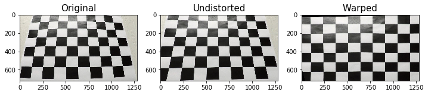


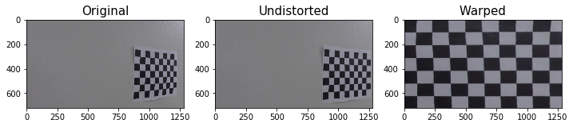


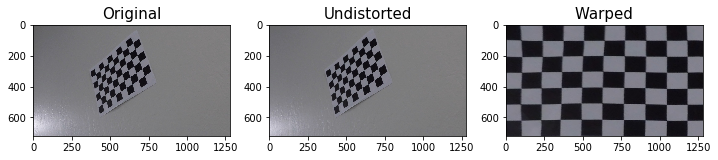

### Step 3: Apply Binary Thresholds
In this step I attempted to convert the warped image to different color spaces and create binary thresholded images which highlight only the lane lines and ignore everything else. 
I found that the following color channels and thresholds did a good job of identifying the lane lines in the provided test images:
- The R and G channel in the RGB colorspace with min threshold of 150

- The S and L Channel from the HLS color space, with a min threshold of 100 and a max threshold of 255 for S and min threshold of 120 and a max threshold of 255 for L. her one, and had a tendency to get distracted by shadows on the road.

I chose to create a combined binary threshold based on the above mentioned binary thresholds, to create one combination thresholded image which does a great job of highlighting almost all of the white and yellow lane lines.


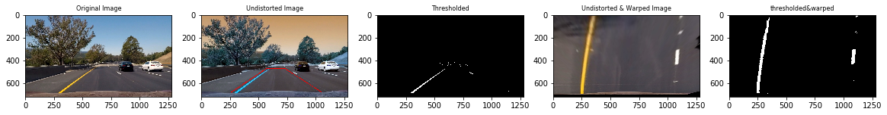


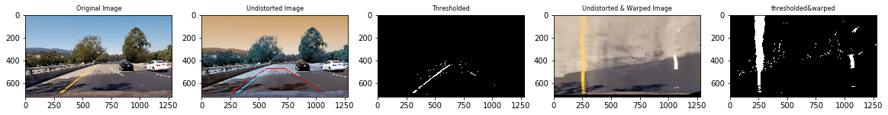


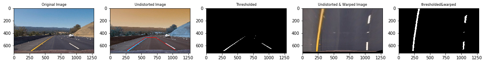


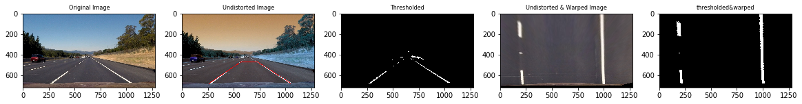


### Step 4: Detecting Lane pixels:
The thresholded image may have lots of white pixels that do not indicate those of the lane lines. So we make use of the histogram that can give us more information about the position of the left and right lanes. A sample histogram is shown below


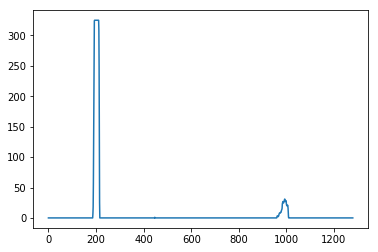


We also know that that all the lane images are not upright at right angles, so we use windowing technique to slice the image and find the lane locations correspondingly. For each window, after the lane positions are found, a quadrilateral is drawn with a small offset and all the pixels within that quadrilateral is marked belonging to that lane. 


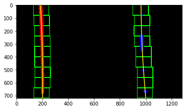

Also as it is a very tedious work to calculate the lane positions and marking down the lane pixels in all the windows for all the images, we make use of the information procesed from the previous image. So only the first image/frame in a video is processed using the sliding window technique and the rest are processed using the prior information.

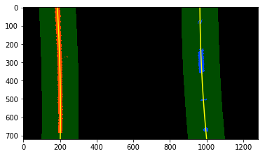

### Step 5: Computing Radius of Curvature and Vehicle Offset:
Using these warped images, we can extract more information about the lanes such as its radius of curvature and the vehicle's offset from the centre of the lane.
While calculating the Radius of Curvature, we make use of the constants,
	ym_per_pix = 30/720 # meters per pixel in y dimension
    xm_per_pix = 3.7/700 # meters per pixel in x dimension
for converting measurable unit from image dimension to more readable format.

### Step 6: Warping lane line back to the original image:
As a transformed was applied in step 2 for perspective transform, here we apply back an inverse transform to add the lane lines back to the actual image.

Below are the 2 sample processed image using the sliding window technique and priori method.


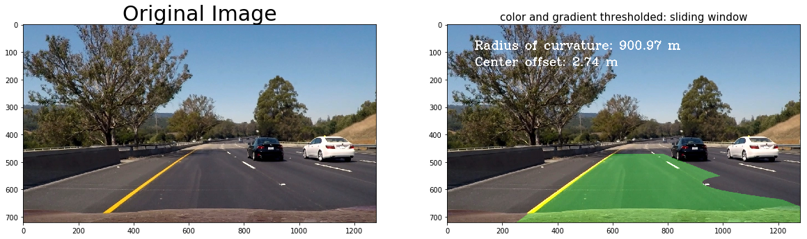


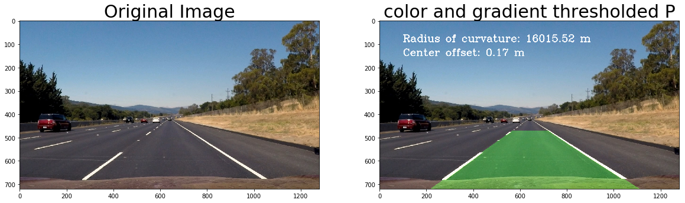


```python
print("PROJECT 4: Advanced Lane Finding........")
```

    PROJECT 4: Advanced Lane Finding........


## Video Processing Pipeline:
All the above mentiones steps constitue the architecture of our pipeline.

A general structure of our pipeline is shown below,

Original Image => Undistorted Image => Thresholded Image => Warped Image => Processing => Information deduction => Unwarping to original image => Annotating the Image => Output

Processing includes finding the lane lines and shading the area inbetween these lane lines.
In information deduction stage, we compute the radius of curvature and vehicle offset. In Image annotating stage, we add these computed information onto the original image frame.

The video pipeline first checks whether or not the lane was detected in the previous frame. If it was, then it only checks for lane pixels in close proximity to the polynomial calculated in the previous frame (using priors). This way, the pipeline does not need to scan the entire image, and the pixels detected have a high confidence of belonging to the lane line because they are based on the location of the lane in the previous frame. 

If at any time, the pipeline fails to detect lane pixels based on the the previous frame, it will go back in to blind search mode (windowing technique) and scan the entire binary image for nonzero pixels to represent the lanes.

After establishing a pipeline to process still images, the final step was to expand the pipeline to process videos frame-by-frame, to simulate what it would be like to process an image stream in real time on an actual vehicle. 

## Possible Limitations:
Using our Lane detecting algorithm, we see that it works fairly for the given road and light condition. But it might not work properly in all weather conditions and in different lighting conditions. 

